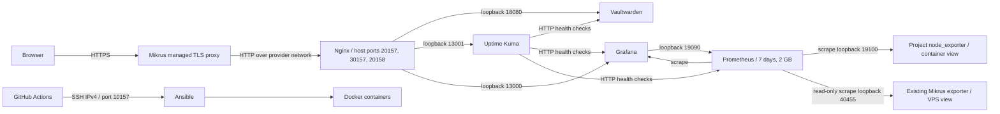
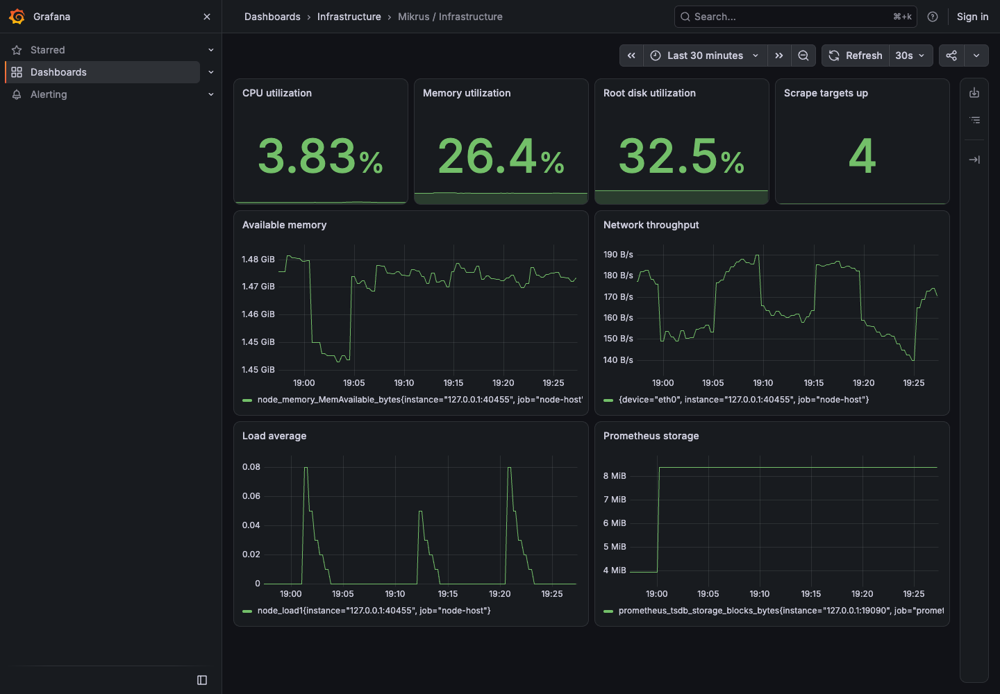
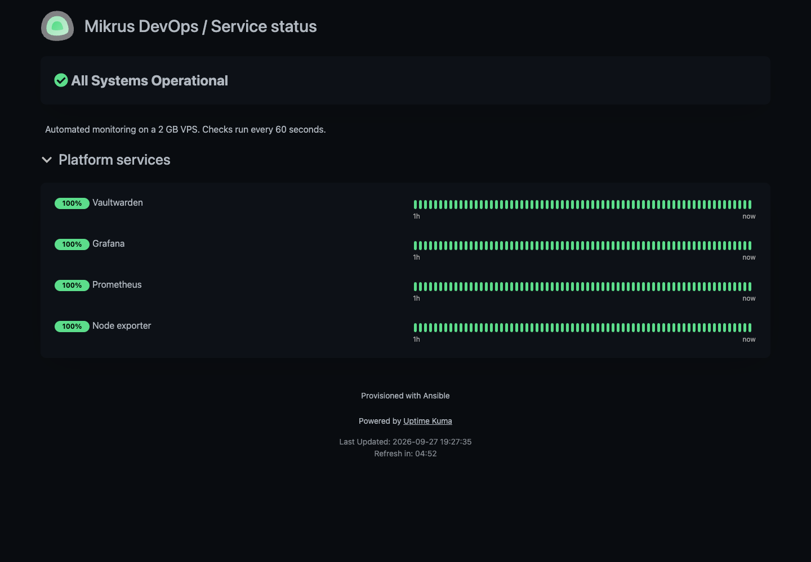
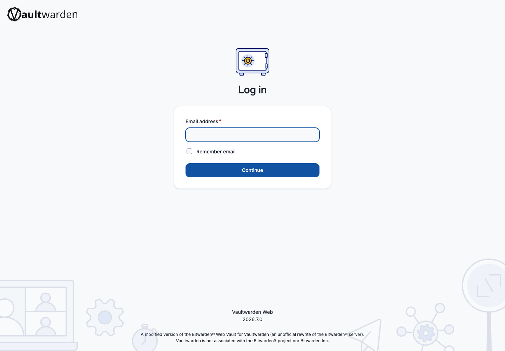

# Mikrus DevOps Portfolio

[](https://github.com/michaljakubowski2001/mikrus-devops-portfolio/actions/workflows/deploy.yml)

An Ansible-managed application and observability platform for a **2 GB RAM / 25 GB disk VPS**.

> Deployed on Mikrus with verified public HTTPS endpoints. See [verification evidence](docs/verification.md) for idempotence, resource measurements and CI results.

## Problem

A small VPS must run a useful application and provide enough operational visibility to diagnose failures without exhausting memory or disk. Manual configuration makes recovery and changes hard to reproduce.

This project combines a private password manager with availability checks, host metrics, version-controlled dashboards and an automated deployment pipeline.

## Architecture



| Service | Public endpoint | Memory ceiling |
| --- | --- | --- |
| Vaultwarden | https://srv70-20157.wykr.es | 256 MiB |
| Uptime Kuma | https://srv70-30157.wykr.es/status/portfolio | 384 MiB |
| Grafana | https://amy157-20158.mikrus.cloud/d/mikrus-infrastructure | 512 MiB |
| Prometheus | Loopback only, port 19090 | 256 MiB |
| node_exporter | Loopback only, port 19100 | 64 MiB |
| Nginx | Public application ingress | 64 MiB |

## Design decisions

- **Ansible roles:** `bootstrap` installs host prerequisites only with explicit authorization; `platform` checks Docker and creates the project root; `stack` manages application configuration, containers and health checks. Normal CI never runs the bootstrap playbook.
- **Pinned dependencies:** Python tools, `community.docker`, application images and Actions are pinned. `scripts/resolve-images.py` resolves explicit image versions to immutable digests; upgrades require review and fresh validation.
- **Resource budget:** container ceilings total 1,536 MiB, leaving approximately 512 MiB for the OS and Docker. These are ceilings, not reservations. OOM and real usage must still be monitored. Prometheus retains seven days subject to a 2 GB size ceiling; size pressure may shorten retention. Container logs rotate at 3 × 10 MB per container.
- **Host networking:** this small Linux host uses loopback-bound application ports and an unprivileged Nginx process on high ports. This avoids Docker-published ports bypassing UFW, while simplifying IPv6 ingress. The trade-off is less network isolation between containers; they share the host network namespace. No container receives the Docker socket.
- **Filesystem boundaries:** configuration and application data live under `/opt/devops-portfolio`. Docker packages, runtime storage and the dedicated SSH authorized key require explicitly approved system-level exceptions. node_exporter reads host filesystems through read-only mounts. Provider services are untouched.
- **Secrets:** only encrypted Ansible Vault ciphertext is committed. The Vault password and private deploy key live in GitHub Actions Secrets and a local ignored `.secrets/` directory. Tasks that handle application credentials use `no_log`. Root and Docker administrators can still inspect runtime credentials.
- **LXC-aware host metrics:** Mikrus uses LXCFS, so the project exporter sees its own 64 MiB container ceiling in `/proc/meminfo`. Prometheus scrapes the existing provider exporter on `127.0.0.1:40455` as job `node-host` for accurate VPS metrics, and the project container as `node-container`. No provider configuration is changed. Ansible verifies that the memory metric matches the VPS memory reported over SSH. On another host, set `host_metrics_port` to a suitable host exporter (19100 is suitable where LXCFS does not virtualize these metrics).
- **Access:** Vaultwarden registration is disabled; its admin endpoint is blocked by Nginx. Grafana permits anonymous read-only viewing of the portfolio dashboard; admin changes require credentials. Kuma is initialized on loopback before Nginx starts, so an unclaimed setup screen is not exposed.
- **TLS:** Mikrus terminates public HTTPS and renews certificates. The hop from its proxy to this VPS is HTTP; this is not end-to-end encryption. Treat this Vaultwarden instance as a portfolio demo, not a store for real passwords, until origin TLS and access restrictions are implemented and verified.
- **Deployment identity:** an independent Ed25519 key has `restrict` applied in `authorized_keys` to disable PTY, agent forwarding and port forwarding. Ansible still executes as root; this key is not a least-privilege sandbox. Pinning the known host key prevents trust-on-first-use in CI.
- **Availability:** this is a single-host system, not HA. Local health monitoring shares the host failure domain. Add external monitoring for complete outage detection. No external notification destination is configured.

## How to run

Use Python 3.13 or newer on the controller and an Ubuntu 24.04 target.

```bash
python3 -m venv .venv
source .venv/bin/activate
pip install -r requirements.txt
ansible-galaxy collection install -r requirements.yml
```

Update `inventories/production/hosts.yml` and `group_vars/all/main.yml` for a different host. Establish SSH trust through a verified host-key fingerprint before running Ansible.

Create `.secrets/vault-password` with mode `0600` and place the deployment public key in `.secrets/deploy-key.pub`. For the current deployment, these files already exist on the original controller. New users must re-encrypt their own `vault.yml` containing `vault_grafana_password`, `vault_kuma_password` and `vault_vaultwarden_admin_token`.

```bash
export ANSIBLE_VAULT_PASSWORD_FILE="$PWD/.secrets/vault-password"
ansible-vault edit inventories/production/group_vars/all/vault.yml
ansible-lint

# Only after explicit approval of Docker installation and SSH-key changes:
ansible-playbook bootstrap.yml -e bootstrap_host_changes_approved=true
ansible-playbook site.yml
ansible-playbook site.yml | tee /tmp/idempotence.log
python scripts/check-idempotence.py /tmp/idempotence.log
bash scripts/smoke-test.sh
```

The second playbook execution must report `changed=0`. The verification script rejects missing recaps, unreachable hosts and failures. Configuration changes restart only the affected services; Grafana periodically reloads provisioned dashboard JSON.

### GitHub Actions

Pull requests run lint without deployment secrets. Pushes to `main` run lint followed by deployment when `DEPLOY_ENABLED=true`. Deployment runs Ansible twice and checks public HTTPS endpoints. Concurrent deployments are serialized.

Required repository secrets:

- `DEPLOY_SSH_KEY`: dedicated private key.
- `SSH_KNOWN_HOSTS`: the verified `[amy157.mikrus.xyz]:10157` host key.
- `ANSIBLE_VAULT_PASSWORD`: password for the committed vault.

The secrets have been populated using `gh secret set`. The production deploy key has been authorized and initial deployment checks have passed. Deployment is enabled with repository variable `DEPLOY_ENABLED=true`.

### HTTPS

The provider documents automatic HTTPS for [forwarded IPv4 ports](https://wiki.mikr.us/wspoldzielona_domena/) and [IPv6 ports](https://wiki.mikr.us/darmowa_subdomena_dla_vps/). Nginx listens on IPv4 and IPv6. All three automatic domains passed the external smoke test without panel changes. The test validates application JSON and current Kuma heartbeat status, rejecting the provider’s misleading HTTP-200 error pages. Public HTTP is also reachable; use the HTTPS links above.

If a custom subdomain is wanted: open the Mikrus panel → subdomains → add a subdomain → select `amy157` → set the backend port (20157 for Vaultwarden, 30157 for Kuma, 20158 for Grafana) → choose HTTP for the backend. Update the corresponding URL in `group_vars/all/main.yml`, then deploy and verify HTTPS again.

### Administration and recovery

Read credentials locally with `ansible-vault view inventories/production/group_vars/all/vault.yml`; never copy that output into issues or logs. Grafana and Kuma use username `admin`. Open the Vaultwarden admin endpoint through an SSH tunnel using the operator key, since the restricted CI key cannot forward ports:

```bash
ssh -4 -p 10157 -L 18080:127.0.0.1:18080 root@amy157.mikrus.xyz
# Open http://127.0.0.1:18080/admin locally.
```

For a consistent application backup, stop the project containers, archive `/opt/devops-portfolio/data`, then restart them and verify health. Store an encrypted copy off-host and test restores. Automated off-host backups are not configured. Prometheus metrics are disposable; Vaultwarden, Kuma and Grafana data are not. A Git revert rolls back configuration and image references, but does not undo database migrations; restore a compatible backup when necessary.

## Screenshots

Actual browser captures of this deployment:







To refresh screenshots, install the optional `playwright` Python package and Google Chrome, then run `python scripts/capture-screenshots.py`.

## Verification

See [the verification record](docs/verification.md) for observed facts, test results and operational limitations.
